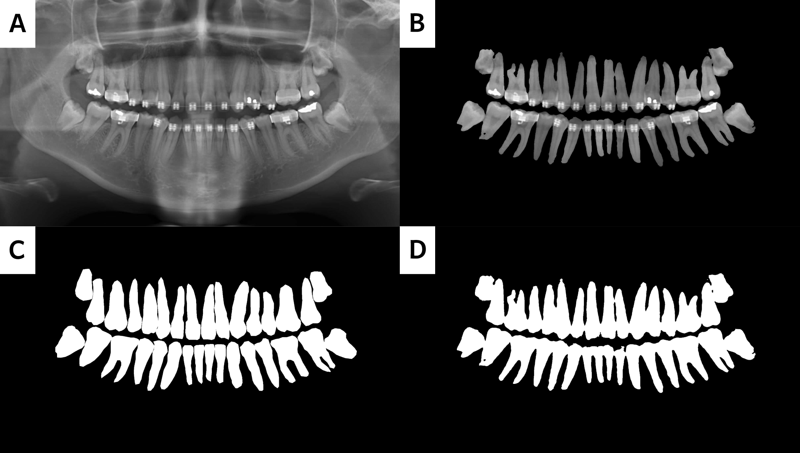
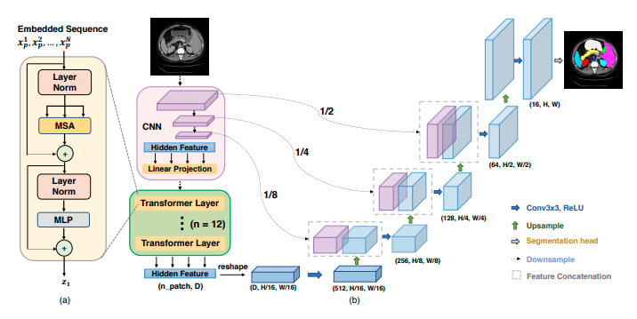

# Panoramic Dental X-Ray Image Semantic Segmentation with TransUnet
The unofficial implementation of [TransUNet: Transformers Make Strong Encoders for Medical Image Segmentation](https://arxiv.org/abs/2102.04306) on Pytorch

*Output of my implementation. (A) Original X-Ray Image; (B) Merged Image of the Predicted Segmentation Map and Original X-Ray; (C) Ground Truth; (D) Predicted Segmentation Map*

## TransUNet
- On various medical image segmentation tasks, the ushaped architecture, also known as U-Net, has become the de-facto standard and achieved tremendous success. However, due to the intrinsic
locality of convolution operations, U-Net generally demonstrates limitations in explicitly modeling long-range dependency. [1]
- TransUNet employs a hybrid CNN-Transformer architecture to leverage both detailed high-resolution spatial information from CNN features and the global context encoded by Transformers. [1]

## Model Architecture

*TransUNet Architecture Figure from Official Paper*

## Dependencies
- Python 3.6+
- `pip install -r requirements.txt`

## Dataset
- UFBA_UESC_DENTAL_IMAGES[2] dataset was used for training.
- Dataset can be accessed by request[3].

## Training
- Training process can be started with following command.
    - `python main.py --mode train --model_path ./path/to/model --train_path ./path/to/trainset --test_path ./path/to/testset `

## Inference
- After model is trained, inference can be run with following command.
    - `python main.py --mode inference --model_path ./path/to/model --image_path ./path/to/image`
    
## Other Implementations
- [Self Attention CV / The AI Summer](https://github.com/The-AI-Summer/self-attention-cv)
- [SOTA Vision / 04RR](https://github.com/04RR/SOTA-Vision)

## References
- [1] [TransUNet: Transformers Make Strong Encoders for Medical Image Segmentation](https://arxiv.org/abs/2102.04306)
- [2] [Automatic segmenting teeth in X-ray images: Trends, a novel data set, benchmarking and future perspectives](https://www.sciencedirect.com/science/article/abs/pii/S0957417418302252)
- [3] [GitHub Repository of Dataset](https://github.com/IvisionLab/dental-image)
